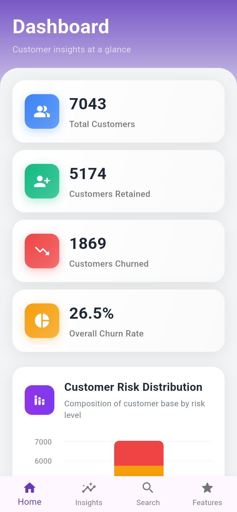
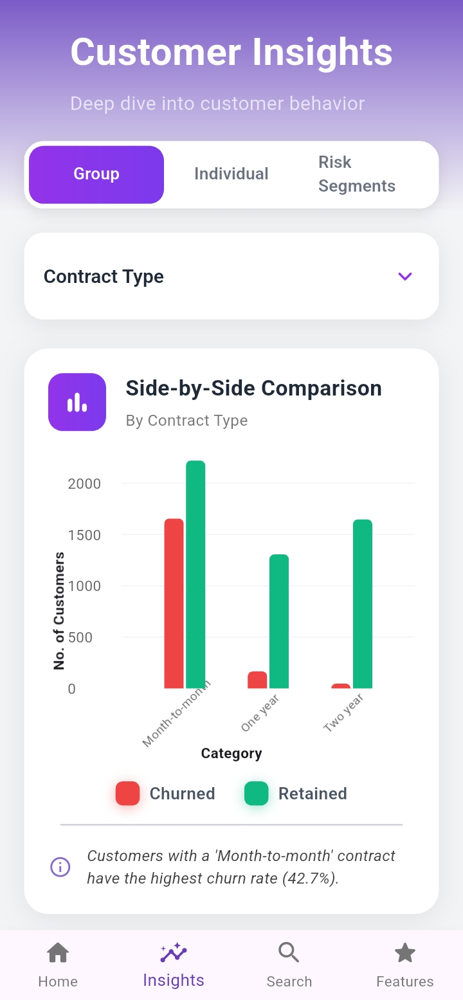

# Customer Churn Prediction

A complete end-to-end system that predicts customer churn using Machine Learning (Python) and visualizes the results through a Flutter-based mobile application. This project helps businesses identify at-risk customers, improve retention strategies, and understand churn drivers through SHAP explainability.

---

## Overview

- **ML Pipeline:** Data preprocessing, XGBoost training with cross-validation, SHAP-based explainability
- **Frontend:** Flutter app consuming batch predictions and feature importance from CSV assets
- **Output:** Actionable churn risk insights with individual feature breakdowns per customer

---

## Screenshots

| Splash Screen | Dashboard Overview | Customer Search |
|---|---|---|
|  |  |  |

| Churn Insights | Feature Breakdown | Risk Distribution |
|---|---|---|
|  |  |  |

--- 

## Core Architecture & System Design

The application enforces a clean separation of concerns, dividing data heavy-lifting from the UI execution layer:

- **Machine Learning Workspace (`/ML`):** Handles exploratory data analysis, natural language processing for customer sentiment feedback, robust feature engineering, model training/cross-validation, and localized SHAP tree execution profiles.
- **Frontend Dashboard App (`/frontend`):** A decoupling-focused cross-platform application built using Flutter. It processes localized data streams seamlessly and employs the `Provider` structural pattern for high-performance state management.

---

## Repository Structure

```
├── ML/
│   ├── notebook/
│   │   ├── data_preprocess.ipynb          # EDA, feature engineering
│   │   └── generate_full_predictions.ipynb # Model training, SHAP export
│   ├── models/                            # (generated: best_xgb_model.pkl)
│   ├── metrics/                           # (generated: predictions.csv, shap_all_customers.csv)
│   └── plots/                             # (generated: diagnostic plots)
│
├── frontend/
│   ├── lib/                               
│   ├── assets/
│   │   ├── images/
│   │   └── screenshots/                        
│   └── pubspec.yaml
│
└── .gitignore                             # Excludes data, models, metrics, plots

```

## Getting Started

### Machine Learning

```bash
pip install -r requirements.txt
jupyter notebook notebook/data_preprocess.ipynb
jupyter notebook notebook/generate_full_predictions.ipynb
```

### Flutter App

```bash
flutter pub get
flutter run
```

## License

MIT License 